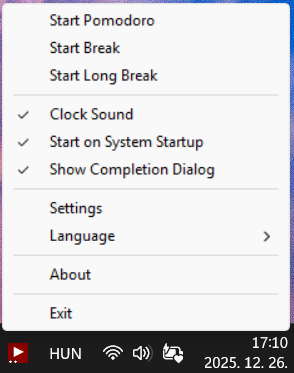

# 番茄钟计时器（Windows 托盘版）

一个轻量、常驻系统托盘的番茄钟工具，支持番茄/休息/自定义计时、手动修正时间与计数，并提供按日记录与周月年统计热力图。

## 项目来源

本项目基于 [lutischan-ferenc/pomodoro-timer-v2](https://github.com/lutischan-ferenc/pomodoro-timer-v2) 开发。



## 已实现功能

- 托盘图标动态显示：运行中显示倒计时，停止时显示 ▶。
- 完全中文菜单与核心交互。
- 自由修改当前剩余时间（分钟）。
- 自由修改今日番茄钟计数。
- 可切换当前静止状态（番茄/休息/自定义），无需立即 Start。
- 自定义计时器模式（不计入番茄钟统计）。
- 支持导入数据、导出数据、恢复默认配置。
- 支持数据位置切换：默认位置、OneDrive、自定义目录（切换时自动迁移数据）。
- 每次完成番茄钟自动写入 `pomodoro_log.csv`。
- `pomodoro_log.csv` 超过阈值后会自动按月归档，降低长期文件膨胀风险。
- 一键打开应用内月历热力图窗口（不依赖浏览器）。
- 支持按月份查看，使用窗口顶部 `<` `>` 切换年月。
- 点击月历中的任意日期，可查看当日完成番茄钟数量。
- 支持一键回到本月；蓝框标记今天，红框标记当前选中日期。
- 颜色深浅按单日 16 次番茄钟上限分层映射（1-4 / 5-8 / 9-12 / 13-16，16+ 统一最深色）。
- 菜单内可直接配置：番茄时长、短休息、长休息、自定义时长、音效、开机启动。

## 使用说明

### 左键点击托盘图标

- 计时中或暂停中：结束当前计时，并切换到下一待机状态。
- 规则：番茄 -> 休息，休息 -> 番茄，自定义 -> 自定义。
- 非计时中：按“当前静止状态”启动对应模式。

### 右键菜单

- 会话：开始、暂停或继续、结束
- 切换：番茄钟/短休息/长休息/自定义计时（运行中也可直接切换）
- 待机：番茄钟/短休息/长休息/自定义计时（计时进行中不可切换）
- 调整：修改剩余时间、增加步进时间、减少步进时间、修改今日计数、计数清零
- 时长：番茄/短休息/长休息/自定义/步进时间/弹窗自动折叠秒数
- 操作：导入数据、导出数据、恢复默认
- 存储：便携模式、OneDrive、自定义位置
- 偏好：时钟音效、完成声音、完成后弹窗、开机启动
- 统计
- 退出

### 快捷控制

- 通过 控制 子菜单执行 开始当前状态/暂停/继续/结束；通过 开始 子菜单可直接切换目标计时模式。
- 从“继续”恢复后会立即退出暂停态并刷新托盘图标显示，不会残留暂停状态。
- 运行中关闭时钟音效会即时静音；重新开启时会即时恢复循环音效。
- `修改当前剩余时间`、`+5分钟`、`-5分钟` 仅在存在活动计时（运行或暂停）时可用。
- 手动修改“今日番茄钟计数”会即时同步到“今日”月历统计，不需要等到第二天。
- 执行“番茄计数清零”同样会即时同步到“今日”月历统计。
- 完成弹窗支持自动折叠为右侧提醒条，不会长期占用右下角空间；点击可展开继续操作。
- 自动折叠秒数可在右键菜单 `时长 -> 弹窗自动折叠(秒)` 中自定义（0 表示不自动折叠）。
- 默认自动折叠为 10 秒，时钟音效默认关闭。
- 完成声音可独立开关，不受时钟音效开关影响。

## 数据文件

- `pomodoro_settings.json`：应用配置与当前计数。
- 配置保存采用临时文件替换策略，降低异常中断导致配置损坏的风险。
- `pomodoro_log.csv`：每日番茄钟完成日志。
- `pomodoro_adjustments.csv`：手动修正每日统计的增量记录（用于即时同步月历显示）。
- 自动归档后会继续读取月归档日志，热力图统计不会因归档而缺失历史数据。
- 无需浏览器报表文件，统计以应用内热力图窗口呈现。

## 编译

在 Windows + MinGW 环境下：

```bash
\mingw32\bin\windres pomodoro-timer.rc -o pomodoro-timer_res.o
\mingw32\bin\gcc -ffunction-sections -fdata-sections -s -o pomodoro-timer pomodoro-timer.c pomodoro-timer_res.o -mwindows -lwinmm -Wl,--gc-sections -static-libgcc
```

## 许可

MIT License
